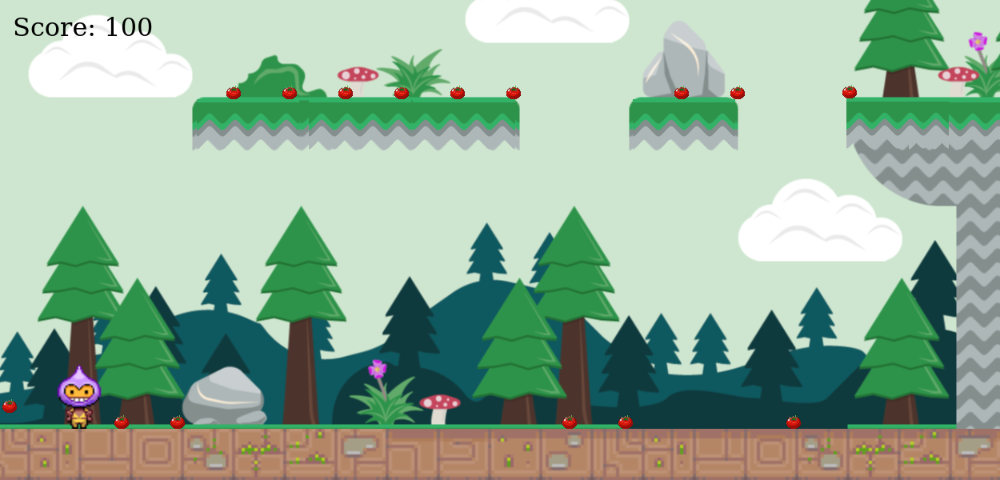
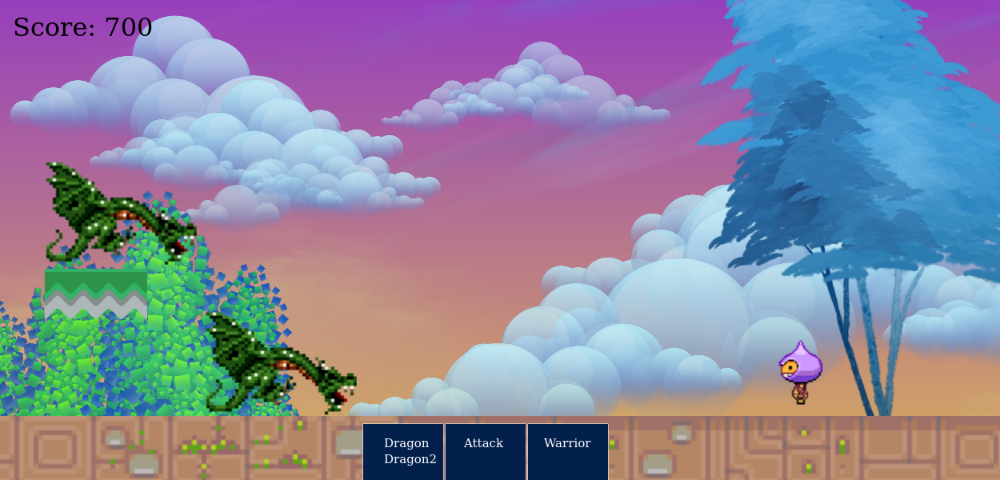

# MAGE WARS

#### This is an NFT game based that allow users to mint their Mage characters and choose a suiting name for their Mage. Each minted Mage has unique attributes. They include:

- DNA: A unique identifier of each Mage's powers.
- Rarity: Ranges from "Original", "Rare" and "Super Rare"
- Level: Initial level is set to 1.
- Description: The forward and backward velocity as well as maximum jump height.

## Video Demo
[Watch Here](https://www.loom.com/share/6d36bfb0b91c47d7947eea6a565a910b)

## Tech Stack

##### Minted NFTs are stored on IPFS for hot storage and Filecoin for cold storage using the nft.storage library. Example code snippet below:

```
const client = new NFTStorage({ token: NFT_STORAGE_KEY });
  const metadata = await client.store({
    name,
    description: "Some texts",
    image: new File(['./assets/example.png'], 'question.png', { type: 'image/jpg' })
  });
```
The smartcontract is deployed to the ### Polygon Mumbai network

## Built With
- Solidity
- React
- JavaScript
- IPFS/Filecoin
- Hardhat
- Ethers
- Polygon
- Alchemy
- HTML5
- CSS3

## Screenshots

#### World Scene


#### Battle Scene


## Getting Started

#### Note: The application is deployed on Polygon testnet but the information below is to allow you to run a local network using Hardhat.

To run a local copy of this application, follow the steps below:

- Go to the "Code" section of this repository and press the green button that says "Code". Copy the URL or the SSH key.
- Go to the terminal and enter:
```
https://github.com/george-shammar/mage-wars.git
```
The URL or SSH are the links copied from the step above.

- If you don't have git installed, you can download this project and unzip it.
- Change directory into the folder the application is saved.
```
cd directory
```
Directory is the name of your folder.


- Once you have the local copy in your desired folder, go back to your terminal and run:
```
npm install
```
This command installs all the dependencies of the application.